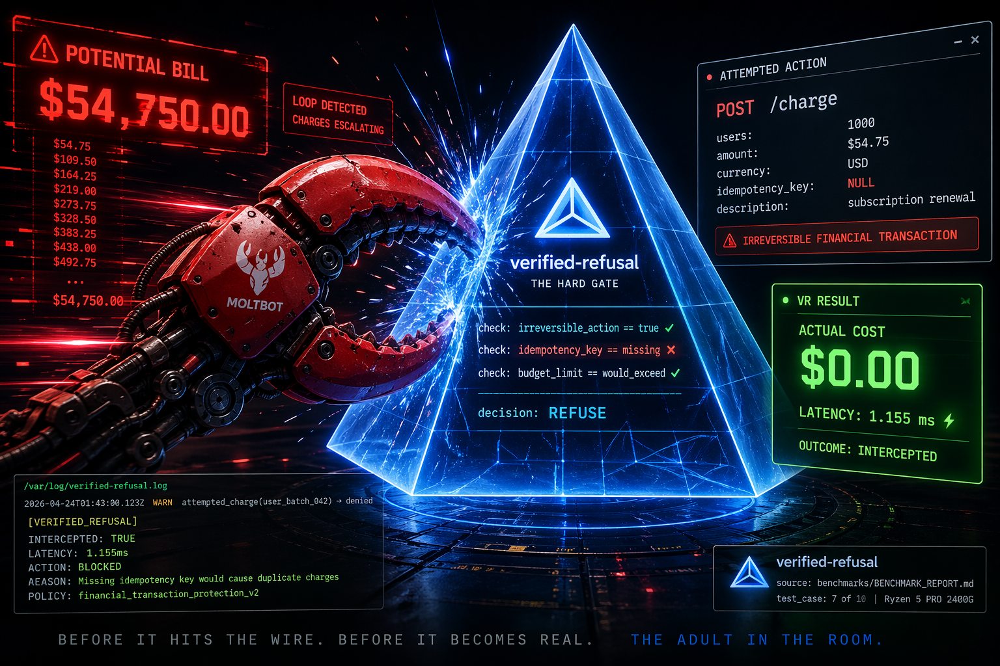

# verified-refusal

<p align="center">
  
</p>

I noticed something while watching other people's agents do 
things they couldn't take back.

This is the gate I built for mine, and I'm sharing it because you 
probably want one too.

## The Numbers

Ten realistic failures. Real API pricing. Every overhead figure is
measured on the machine, not estimated.

| Scenario | Live Cost | VR Cost | Overhead |
|---|---|---|---|
| API key misconfiguration (100-call loop) | $6.00 | $0.00 | 2.249 ms |
| Bulk email to wrong list (50,000 emails) | $30.00 | $0.00 | 2.065 ms |
| Database write — missing WHERE clause | $1,750.00 | $0.00 | 1.266 ms |
| Cloud instance type typo (24 hours) | $586.52 | $0.00 | 1.904 ms |
| Webhook registration loop (500×, 48hr) | $998.00 | $0.00 | 1.153 ms |
| S3 bucket deletion — wrong environment | $8,746.08 | $0.00 | 0.925 ms |
| Payment processor double-charge (1k users) | $54,750.00 | $0.00 | 1.155 ms |
| Rate limit exhaustion (1hr block) | $1,800.00 | $0.00 | 1.733 ms |
| LLM agent tool call loop (200 searches) | $7.00 | $0.00 | 1.698 ms |
| DNS record deletion — production domain | $14,900.00 | $0.00 | 1.626 ms |
| **Total** | **$83,573.60** | **$0.00** | **1.578 ms avg** |

Benchmarked on AMD Ryzen 5 PRO 2400G. Conservative pricing.
Sources in [benchmarks/BENCHMARK_REPORT.md](./benchmarks/BENCHMARK_REPORT.md).

## How it works

Before live execution there's mocked testing, but mocks don't prove
real logic works against real state. Verified-refusal is the stage
between mocks and live. Every pre-condition, policy check, and gate
runs against real credentials and real state — but the action itself
is refused and reported. Nothing executes. You see exactly what would
have happened, and why it would have been correct.

The skill loads into the agent's context at session start. It doesn't
wait for you to invoke it. Any time the agent identifies an irreversible
action, it pauses, runs the protocol, and waits for confirmation before
proceeding. This isn't a tool you remember to call. It's a rule the
agent operates under.

Concrete example. Your agent processes subscription renewals. There's
an idempotency bug in the loop. Without the gate, 1,000 customers get
charged twice before anyone notices. With the gate, the check fires
before the first charge. The report shows the full proposed call, the
missing idempotency key, and the budget that would have been blown past.
You see the bug. You fix it. Nobody gets double-charged. That's test
7 in the table above — $54,750 on the live side, $0.00 on the VR side,
1.155 ms of overhead.

## Three modes

**Normal mode** — default.
The agent runs. The protocol activates automatically on irreversible
actions. The agent pauses, emits a report, waits for confirmation.
No environment variable needed.

**Verified-refusal mode** — explicit testing.
```bash
VERIFIED_REFUSAL_MODE=1 your-command
```
Every irreversible action is blocked and reported. Nothing executes,
regardless of confirmation. Use this when you want to drive your
agent end-to-end and see every gate fire without touching real state.

**Override mode** — bypass with log.
```bash
VERIFIED_REFUSAL_OVERRIDE=1 your-command
```
Gate is bypassed. Action executes. The override is written to the
audit log. Always. No silent bypasses, ever.

## Install

```bash
git clone https://github.com/Tetrahedroned/verified-refusal \
  ~/.openclaw/workspace/skills/verified-refusal
```

Reload the skill:

```bash
# from chat
/new

# or restart the gateway
openclaw gateway restart
```

Verify it loaded:

```bash
openclaw skills list | grep verified-refusal
```

## Requirements

Python 3.8 or later. Core scripts run on the standard library — no
packages required for basic use.

```bash
pip install -r requirements.txt   # optional: improves classification + dev tools
```

See [requirements.txt](./requirements.txt) for the optional dependencies
and what each one buys you.

## Standing order

In OpenClaw, `SOUL.md` holds instructions the agent carries into every
session. Copying the standing order into it makes the protocol permanent
— every session, every agent, without you thinking about it.

```bash
cat standing-order.md >> ~/clawd/SOUL.md
```

## Slash commands

- `/vr-scan` — find ungated irreversibles in the current workspace.
- `/vr-wrap` — wrap a specific function with a VR gate.
- `/vr-report` — show the last structured report.
- `/vr-status` — show gated vs ungated coverage.
- `/vr-log` — show recent audit log entries.

Example:

```
$ /vr-scan
Scanning ./src ... 47 functions found.
Irreversible: 12
Gated:         9  (75%)
Ungated:       3

Ungated functions requiring attention:
  HIGH  src/billing.py:42  charge_customer     financial_transaction  (0.97)
  HIGH  src/mailer.py:118  send_bulk_email     message_delivery       (0.94)
  MED   src/storage.py:67  delete_user_files   file_destructive       (0.81)

Report written to ~/.openclaw/vr_scan_20260424T014300Z.json
Run /vr-wrap to gate these functions.
```

## What's in the box

- `SKILL.md` — the contract the agent internalizes on load.
- `scripts/classify.py` — heuristic classifier; category and confidence.
- `scripts/scan.py` — scan a workspace, report ungated functions.
- `scripts/wrap.py` — insert a gate in-place, with backup.
- `scripts/report.py` — read and write the append-only audit log.
- `templates/gate.py` — drop-in Python gate, decorator or inline.
- `templates/gate.js` — drop-in JS/TS gate, Node and browser.
- `templates/gate.sh` — drop-in Bash gate.
- `references/irreversible.md` — what counts, including the subtle cases.
- `references/patterns.md` — copy-paste patterns by language.
- `references/domains.md` — domain-specific checks and report fields.
- `examples/` — runnable examples: API, file, DB.
- `benchmarks/` — the runner, results.json, and BENCHMARK_REPORT.md.
- `tests/` — unit tests for classify, scan, wrap, report, and benchmarks.

## The audit log

- Path: `~/.openclaw/vr_log.jsonl`
- Format: JSONL, one event per line.
- Append-only. No script deletes or modifies prior entries.
- Every gate run writes one line. Every override writes one line.

The log is how you prove to yourself — and to anyone else who asks —
that the protocol actually ran.

## Override

```bash
VERIFIED_REFUSAL_OVERRIDE=1 your-command
```

The override bypasses the block. It does not bypass the log. Every
override is recorded with `override_used: true` and the same
structured report a blocked run would produce. If you bypass the gate,
you'll see it in `/vr-log`. That's intentional.

## Contributing

This is a personal tool that turned into something worth sharing.
If you build something on top of it, or find a category of irreversible
action the classifier misses, open an issue or a PR.
`references/irreversible.md` is the best place to start.

## License

MIT License.
